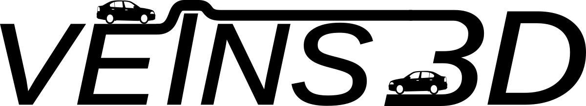

  

# Veins 3D
Veins 3D is an extension of the Veins framework for three-dimensional simulation scenarios including the support of 3D antenna patterns as well as several models covering the influence of a three-dimensional environment.

## Publications
Detailed explanations as well as sample simulations (and results) can be found in the following papers:
* Alexander Brummer, Reinhard German and Anatoli Djanatliev, "On the Necessity of Three-Dimensional Considerations in Vehicular Network Simulation," 14th IEEE/IFIP Conference on Wireless On demand Network Systems and Services (WONS 2018), Isola 2000, France, February 2018.
* Alexander Brummer, Thomas Deinlein, Kai-Steffen Hielscher, Reinhard German and Anatoli Djanatliev, "Measurement-Based Evaluation of Environmental Diffraction Modeling for 3D Vehicle-to-X Simulation," 10th IEEE Vehicular Networking Conference (VNC 2018), Taipei, Taiwan, December 2018
* Alexander Brummer, Reinhard German and Anatoli Djanatliev, "Modeling V2X Communications Across Multiple Road Levels," 90th IEEE Vehicular Technology Conference (VTC2019-Fall), 2nd IEEE Connected and Automated Vehicles Symposium (CAVS 2019), Honolulu, HI, USA, September 2019
* Alexander Brummer, Lorenz Ammon and Anatoli Djanatliev, "N-Ray Ground Interference: Extending the Two-Ray Interference Model for 3D Terrain Shapes," 11th IEEE Vehicular Networking Conference (VNC 2019), Los Angeles, CA, USA, December 2019
* Alexander Brummer, Moritz Guetlein, Matthias Schaefer, Reinhard German and Anatoli Djanatliev, "Experimental Evaluation of the N-Ray Ground Interference Model," 12th IEEE Vehicular Networking Conference (VNC 2020), Ulm, Germany (Virtual Event), December 2020
* Alexander Brummer, Thomas Deinlein and Anatoli Djanatliev, "On the Simulation of Vehicular Networking Scenarios in Multi-Story Parking Garages," 13th IEEE Vehicular Networking Conference (VNC 2021), Ulm, Germany (Virtual Event), November 2021 (to appear)

## Usage
Veins 3D is based on Veins 4.7.1, but also incorporates a few changes from Veins 5 to allow the usage of more recent SUMO versions.

The current version of Veins 3D has been tested with OMNeT++ 5.2 and SUMO 1.8.0.
For necessary adaptations in SUMO 1.8.0, have a look at the provided patch file *sumo-1.8.0-3Dchanges.patch*.
